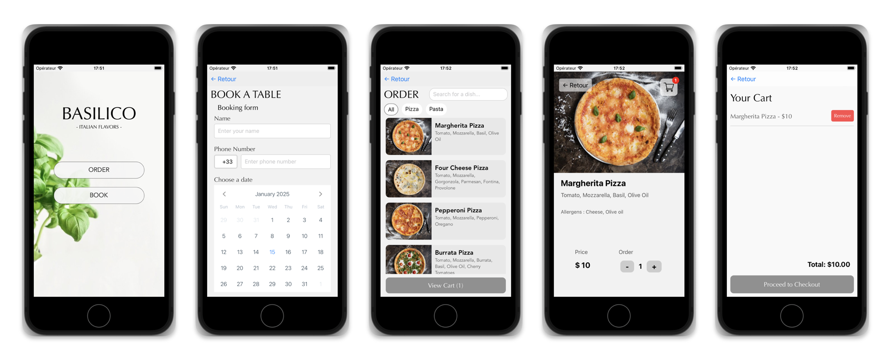

# resto-frontend-app

This work was initiated to complete mandatory assignments from **INFT2508 - Cross platfrom App development for Mobile Devices** course from the Norwegian University of Science and Technology (**NTNU**)

The aim of this work was to create a React Native front-end for an restaurant app. We had to use multiple technology to discover and practice using some of the greatest features React-native can offers.

Moreover, this app is build in paralell of an super simple API. To enable exchanges between my application and a server, I've coded a simple REST API myself that lets me manage data on a remote server and respond to requests from my application. The API is available here: https://github.com/yannduffo/simple-rust-rest-api.

# Basilico App

This app was build and design for a fancy italian restaurant.
There are currently 5 pages (each page got a diffrent "screen" in the ./screens/ repertory):

- The landing page (front page) where there are 2 buttons "ORDER" and "BOOK"
- The "Order" page where it is going to be a list of the dish proposed by the restaurant (the list come from the **data received from the API**) (with a full working **search bar** and **filters**). Each dish will be cliackable to obtain some details -> a click on a dish open a _DishDetailScreen_.
- The _BookScreen_ where it's possible to book a table on a specific day at a fixed hour with a simple form (sending a reservation to the API)
- The _DishDetailScreen_ who is dynamiquely generated regarding which dish was clicked on the OrderScreen. You can add a product in the cart from this page with **dynamic rendering** to simplify user experience and navigation.
- The _CartScreen_ which is a Cart where you see the products you added and remove them if you want (there also is a button to checkout).

-> These screens are managed with the **react-navigation** library using the "**stack**" navigation method.

In particular, the exercice also asked us to use : `react-native contexts`, `useState`, `useEffects`, `fetch` to communicate with the API, custom reusable components, ...

## What does the app looks like ?

Below are presented a screenshot of the 5 main screens :



## Getting started

If you want to try to run the app follow these instructions :

```
git@github.com:yannduffo/resto-frontend-app.git
```

```
cd resto-frontend-app
npm install
npx pod-install ios
npm run ios
```

The `run ios` script starts the app on an Iphone SE 3rd generation.

## Future improvements

- As it was one of my first react-native app I didn't really respected TSX syntaxe. I should dorrect the warnings regardind _types_ by creating explicite types (according to the TSX syntaxe)
- Link the app with a real more complete back-end to enable user connexion, cart checkout transmission, ...

## References

The cart icon is from flaticon.com availiable here : https://www.flaticon.com/free-icon/shopping-cart_1170678?term=cart&page=1&position=3&origin=search&related_id=1170678 by **@Freepick**

All the images are taken from a real italian restaurant franchise : _Olivia Company_

<br>
<br>
<br>
Created by Yann Duffo
